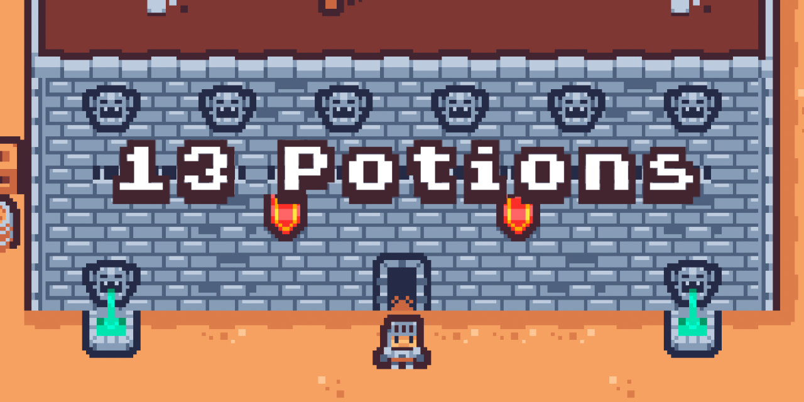

<a href="https://thirteen-potions.netlify.app/">
  

    
  

</a>

You are a knight who has to collect the 13 potions in the castle as fast as possible. But be careful, there's 13 ghosts who want to slow you down!

**[Play now!](https://thirteen-potions.netlify.app/)**

(my current fastest time is 52 seconds, lmk if you beat me)

## Why

This is my first attempt at game dev for [js13kgames 2023](https://js13kgames.com/)! I misread the rules and didn't realize that the game framework I picked would count towards the game size (classic) but it's my first time making a real game with a framework so I'm going to take it!

[Here's the submission on the game jam website.](https://js13kgames.com/entries/thirteen-potions)

## How

I used [Phaser](https://phaser.io/) as the framework, some [Kenney assets](https://www.kenney.nl/assets/tiny-dungeon) for the tileset, [Aseprite](https://www.aseprite.org/) for updating individual tiles and making my own sprites, and [Tiled](https://www.mapeditor.org/) for creating the map! It was my first time using all of these tools so I might not have done it perfectly, so don't use this code as a role model for anything besides good ol' fun.
